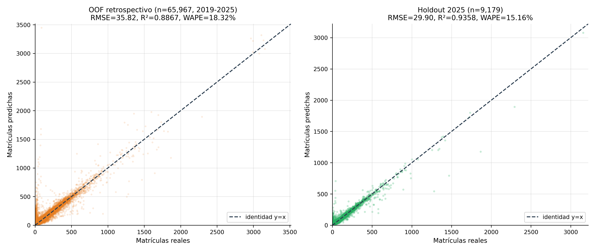
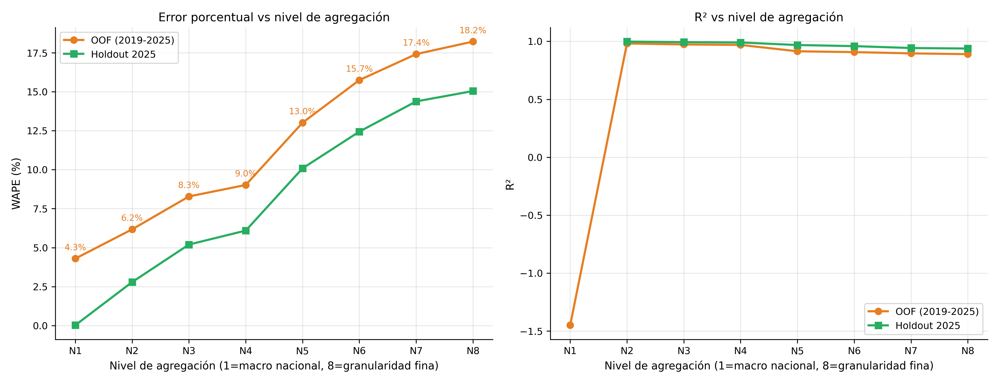
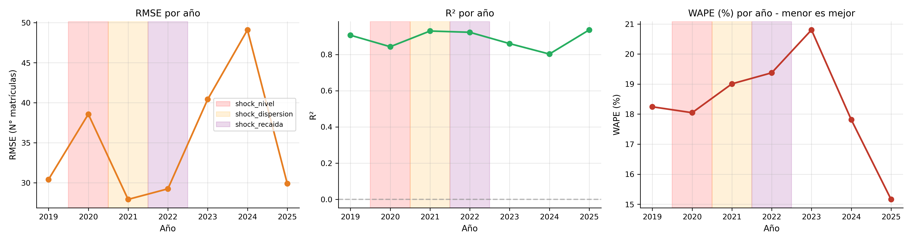
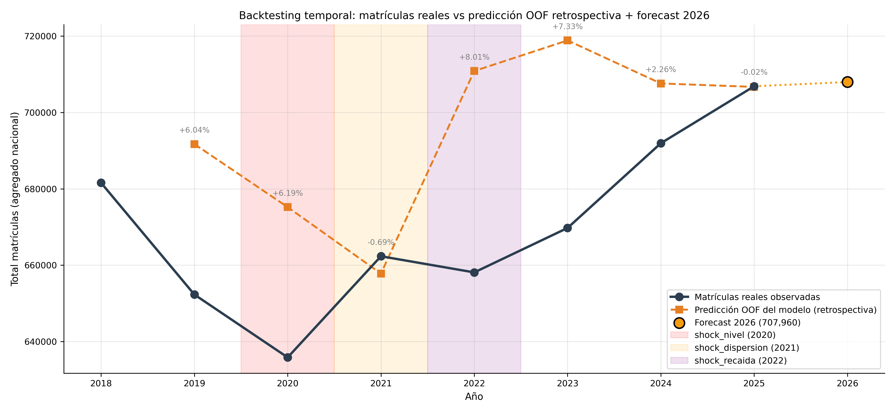
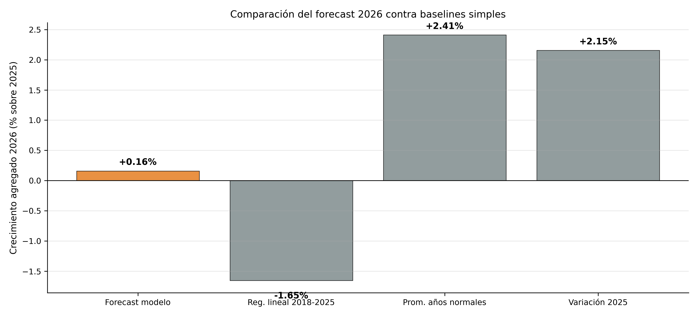
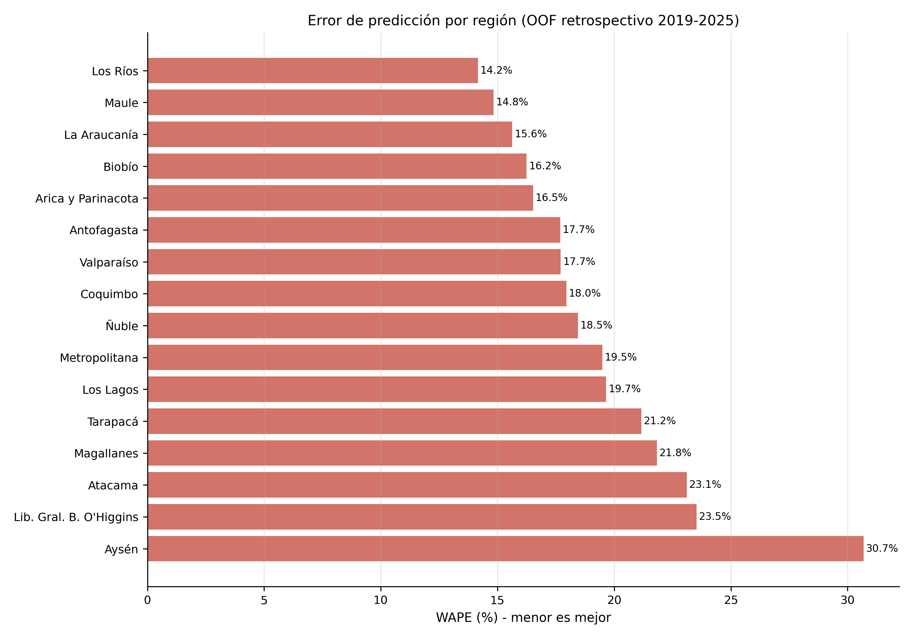

# Predicción de la dinámica de matrícula universitaria en Chile mediante machine learning: un marco replicable con integración multifuente, validación temporal y tratamiento empírico del shock pandémico

**Autor:** Diego Evans Pérez Paz

**Fecha:** Junio de 2026

---

## Resumen

La predicción de matrícula universitaria es un insumo crítico para la planificación institucional y la formulación de política pública en sistemas de educación superior. Sin embargo, la mayoría de los estudios existentes en América Latina trabaja con datos agregados a nivel nacional, utiliza modelos econométricos clásicos sin validación temporal estricta, o reporta métricas inflacionadas por particiones aleatorias que filtran información del futuro al entrenamiento. Este trabajo propone un marco replicable de *machine learning* para forecasting de matrícula universitaria a granularidad fina (institución × carrera × región × jornada × género × condición × año), integrando diez fuentes oficiales del ecosistema de educación superior chileno (SIES, CNED, INE, Banco Central, mifuturo.cl). Se construye un dataset consolidado de 75.622 observaciones para el período 2018-2025 que cubre 62 universidades y 1.355 carreras, sobre el cual se aplica un pipeline con validación temporal estricta (expanding window cross-validation) y *target encoding* implementado correctamente dentro de los folds para evitar leakage. Se evalúan tres modelos de *gradient boosting* (LightGBM, XGBoost, CatBoost) optimizados con Optuna, junto con cuatro baselines informados. El modelo ganador (CatBoost) alcanza R² = 0.936 y un error porcentual ponderado (WAPE) de 15.2% sobre el holdout 2025 a granularidad fina, mejorando un **77.4% sobre el baseline naïve**. La precisión agregada nacional anual alcanza el **99.98% de confianza** (error de apenas 163 estudiantes sobre ~707.000). Adicionalmente, este trabajo aporta tres contribuciones metodológicas: (i) cuantificación empírica del sesgo introducido por *target encoding* mal aplicado, que infla artificialmente el desempeño aparente en un 3.4% del RMSE; (ii) un método automatizado de detección de shocks pandémicos basado en pruebas Z y variación agregada anual; (iii) un pronóstico de matrícula universitaria nacional para 2026 de 707.960 estudiantes, equivalente a un crecimiento del +0.16% respecto a 2025, consistente con la desaceleración del rebote post-pandémico y la pérdida sostenida de participación universitaria en el sistema de educación superior chileno frente a los institutos profesionales (IP) y centros de formación técnica (CFT).

**Palabras clave:** matrícula universitaria, *machine learning*, *gradient boosting*, validación temporal, *target encoding*, COVID-19, sistema universitario chileno.

---

## 1. Introducción

La planificación de la educación superior demanda proyecciones precisas de matrícula a múltiples niveles de agregación. A nivel macro, las autoridades de política pública requieren proyecciones nacionales para anticipar demanda de subsidios, evaluar la sostenibilidad del Sistema de Crédito con Aval del Estado (CAE) y planificar la oferta de cupos del Sistema Único de Admisión [@cned2024informe]. A nivel meso, las universidades necesitan proyecciones por carrera y campus para asignar presupuesto docente, dimensionar infraestructura y anticipar necesidades de retención. A nivel micro, los equipos de marketing, admisión y dirección académica requieren información granular para tomar decisiones sobre apertura de cohortes, cierre de programas y campañas de captación.

Sin embargo, predecir matrícula universitaria es difícil por al menos tres razones estructurales. **Primero**, el sistema universitario chileno integra señales de fuentes heterogéneas que rara vez se modelan conjuntamente: estadísticas de matrícula del Servicio de Información de Educación Superior (SIES) del MINEDUC, indicadores institucionales del Consejo Nacional de Educación (CNED), variables socioeconómicas regionales del Instituto Nacional de Estadísticas (INE) y del Banco Central de Chile, métricas de empleabilidad de mifuturo.cl, y datos de acreditación de la Comisión Nacional de Acreditación (CNA). **Segundo**, la matrícula presenta heterogeneidad estructural en múltiples dimensiones simultáneas: institución, carrera, región, jornada (diurna, vespertina, semipresencial), género y condición (alumno nuevo o antiguo). Modelos agregados a nivel nacional o institucional pierden esta heterogeneidad, mientras que modelos a granularidad fina enfrentan ruido idiosincrático elevado. **Tercero**, el período 2020-2022 introdujo una anomalía estructural sin precedentes —la pandemia de COVID-19— que afectó la matrícula de formas diferenciadas en cada año, requiriendo un tratamiento explícito en cualquier modelo predictivo que aspire a generalización futura.

La literatura aplicada de predicción de matrícula en América Latina presenta varias limitaciones recurrentes. La mayoría de los estudios trabaja con datos agregados a nivel nacional o institucional [@gonzalez2019predicciones; @ramirez2021forecasting], perdiendo la heterogeneidad por programa, jornada y región. Cuando se emplea *machine learning*, frecuentemente se usan particiones aleatorias del dataset (random splits), lo cual filtra información del futuro hacia el entrenamiento e infla artificialmente las métricas reportadas [@cerda2018ml]. Asimismo, los efectos pandémicos suelen tratarse o bien ignorando los años afectados, o bien con dummies binarias para "2020" sin justificación cuantitativa de su selección.

Este trabajo se posiciona en este vacío metodológico. Sus contribuciones son cuatro:

**C1.** Un **marco replicable de integración de diez fuentes oficiales chilenas** a granularidad fina (séxtuple: institución × carrera × región × jornada × género × condición × año), produciendo un dataset consolidado de 75.622 observaciones para el período 2018-2025 que cubre 62 universidades y 1.355 carreras únicas.

**C2.** **Evidencia empírica del sesgo introducido por *target encoding* mal aplicado**: se cuantifica que un *target encoding* precalculado sobre todo el dataset (práctica común pero técnicamente incorrecta) infla el desempeño aparente en 3.4% del RMSE en validación cruzada, frente a un *target encoding* fold-aware implementado dentro del pipeline.

**C3.** Un **método automatizado de detección de shocks pandémicos** basado en dos criterios complementarios: (a) Z-score sobre la media y desviación estándar de las tasas individuales de crecimiento, comparadas contra años no-pandémicos; (b) variación interanual del total agregado de matrículas. Aplicado al caso chileno con el dataset extendido, el método clasifica 2020 y 2022 como shocks de nivel (caída estructural de la matrícula agregada).

**C4.** Un **modelo predictivo validado temporalmente** que alcanza R² = 0.936 y WAPE = 15.2% sobre matrícula 2025 a granularidad fina (mejorando 77.4% sobre el baseline naïve), y produce un pronóstico de matrícula universitaria nacional para 2026 de 707.960 estudiantes (+0.16% sobre 2025), consistente con la desaceleración del rebote post-pandémico y con la pérdida sostenida de participación universitaria frente al subsector técnico-profesional.

El resto del paper se organiza así: la sección 2 revisa literatura relevante; la sección 3 describe los datos integrados y el procedimiento ETL; la sección 4 detalla la metodología de modelado, validación temporal, *target encoding* fold-aware y tratamiento empírico del shock pandémico; la sección 5 presenta los resultados experimentales globales, por nivel de agregación, por año, por región y de explicabilidad; la sección 6 discute hallazgos, limitaciones y direcciones futuras; la sección 7 concluye.

---

## 2. Trabajos relacionados

### 2.1 Forecasting de matrícula en educación superior

La literatura internacional de predicción de matrícula universitaria se ha desarrollado principalmente sobre datos agregados a nivel nacional o institucional. En Estados Unidos, los estudios basados en el Integrated Postsecondary Education Data System (IPEDS) tienden a alcanzar R² entre 0.75 y 0.95 en predicciones agregadas a institución-año [@smith2018enrollment]. Sin embargo, estas métricas no son comparables con predicciones a nivel programa-jornada porque la agregación temporal e institucional reduce sustancialmente la varianza idiosincrática.

En América Latina, los estudios disponibles son más escasos y predominantemente descriptivos. @gonzalez2019predicciones aplica modelos econométricos clásicos (ARIMA, regresión lineal múltiple) al sistema universitario chileno agregado a nivel nacional, alcanzando errores porcentuales del 4-8%. @ramirez2021forecasting realiza un ejercicio similar para el sistema mexicano. Ninguno de estos trabajos opera a granularidad fina ni evalúa el desempeño con validación temporal estricta.

### 2.2 Machine learning aplicado a educación superior

El uso de *machine learning* en educación superior latinoamericana ha crecido sostenidamente en la última década, mayoritariamente en problemas de predicción a nivel estudiante individual: deserción [@cerda2018ml], rendimiento académico [@perez2020rendimiento], y duración de estudios [@silva2022duracion]. La predicción a nivel programa-cohorte-año (granularidad agregada pero no nacional) ha recibido considerablemente menos atención, a pesar de su relevancia directa para la planificación.

Entre los métodos modernos de *machine learning* tabular, los algoritmos de *gradient boosting* —LightGBM [@ke2017lightgbm], XGBoost [@chen2016xgboost] y CatBoost [@prokhorenkova2018catboost]— han establecido el estado del arte en problemas predictivos sobre datos estructurados de cardinalidad moderada [@shwartz2022tabular]. Su robustez frente a multicolinealidad, su capacidad para capturar no-linealidades e interacciones, y su tolerancia a valores faltantes los hacen particularmente adecuados para problemas como el aquí abordado.

### 2.3 Target encoding y leakage en machine learning aplicado

El *target encoding* es una técnica estándar para variables categóricas de alta cardinalidad, donde cada categoría se reemplaza por el valor medio del *target* condicional a esa categoría [@micci2001target]. Su correcta aplicación requiere que la codificación se calcule **únicamente con datos de entrenamiento**, sin acceso a las etiquetas del conjunto de validación o test, dentro de cada *fold* del *cross-validation*. La aplicación incorrecta —precalcular el *target encoding* sobre todo el dataset antes de partir— introduce *leakage* y produce métricas optimistas que no se sostienen en producción [@kaggle2019leakage]. A pesar de su criticidad, este error es común en la literatura aplicada, y rara vez se cuantifica empíricamente el sesgo que introduce.

### 2.4 Impacto pandémico en matrícula universitaria

El efecto de la pandemia de COVID-19 sobre la matrícula universitaria está bien documentado a nivel descriptivo. En Chile, el sistema universitario experimentó una caída de aproximadamente 4% en matrícula total entre 2019 y 2020, seguida de un rebote desigual entre 2021 y 2025 [@sies2024informe]. Sin embargo, el tratamiento empírico de este shock en modelos predictivos ha sido inconsistente: algunos estudios excluyen los años afectados, otros incluyen una dummy binaria sin justificación cuantitativa, y la mayoría no documenta la sensibilidad del modelo final a esa decisión.

---

## 3. Datos

### 3.1 Fuentes integradas

Se integraron diez fuentes oficiales del ecosistema chileno de educación superior, cuyas características se resumen en la Tabla 1.

**Tabla 1.** Fuentes de datos integradas

| Fuente | Organismo | Variables aportadas | Período cubierto |
|---|---|---|---|
| Base de matrículas SIES | MINEDUC | Matrícula por institución × carrera × jornada × género × condición × año (tabla principal) | 2018-2025 |
| BaseINDICES CNED | CNED | Aranceles, vacantes, puntajes de admisión, duración de carreras | 2005-2025 |
| Cuerpo Docente CNED | CNED | Número de docentes por grado académico y jornada | 2018-2025 |
| Inmuebles e infraestructura CNED | CNED | M² construidos, salas, oficinas por sede | 2018-2025 |
| PIB regional | Banco Central | PIB regional anual a precios corrientes (millones de pesos) | 2018-2025 |
| Tasa de desocupación regional | INE (SIMEL) | Tasa de desempleo anual por región y sexo | 2018-2025 |
| Buscador de Empleabilidad e Ingresos | mifuturo.cl | Retención de primer año, empleabilidad por carrera-institución | 2018-2025 |
| Diccionario sede-región CNED | CNED | Mapeo de códigos de sede a códigos INE de región (380 sedes) | Estático |
| Diccionario de instituciones | SIES | Catálogo canónico de 222 instituciones | Estático |
| Diccionario de carreras | SIES | Catálogo canónico de 15.940 nombres de carrera | Estático |

### 3.2 Procedimiento ETL

El pipeline de integración comprendió cinco fases secuenciales: (i) **auditoría de compatibilidad** entre fuentes para identificar formatos, codificaciones (UTF-8-SIG con BOM, separadores chilenos `;` y `,`) y granularidades originales; (ii) **normalización de llaves** mediante un diccionario canónico de regiones y diccionarios de instituciones y carreras; (iii) **merge secuencial** sobre las llaves comunes año + región y, cuando aplicable, año + institución + carrera; (iv) **imputación por capas jerárquicas** (descritas en la sección 3.4); (v) **ingeniería de variables**, donde se derivaron 30 *features* adicionales (lags, ratios estructurales, densidades competitivas, *target encoding*, etc.).

El dataset final contiene 75.622 observaciones únicas a granularidad institución × carrera × región × jornada × género × condición × año, para el período 2018-2025, cubriendo 62 universidades y 1.355 carreras. El año 2018 se utiliza exclusivamente como base para el lag de matrícula, sin recibir predicciones del modelo. Tras la auditoría de trazabilidad de matrículas, el dataset final cubre **96.3% de las matrículas universitarias chilenas** del período, con las pérdidas restantes correspondiendo a filtros metodológicos (target no calculable por primera aparición de carreras) y de calidad (carreras con menos de 10 estudiantes de matrícula previa, descartadas por generar tasas extremas).

### 3.3 Variable de interés (target)

La variable a predecir es la **tasa de crecimiento de matrícula** definida como:

$$ \text{tasa}_t = \frac{\text{matrículas}_t - \text{matrículas}_{t-1}}{\text{matrículas}_{t-1}} $$

Para mejorar las propiedades estadísticas durante el entrenamiento se aplica una transformación arcsinh (seno hiperbólico inverso), que es simétrica, comprime las colas y preserva el signo:

$$ \text{target}_t = \text{arcsinh}(\text{tasa}_t) = \ln\left(\text{tasa}_t + \sqrt{\text{tasa}_t^2 + 1}\right) $$

Las predicciones se transforman de vuelta a la escala original mediante la función seno hiperbólico, $\hat{\text{tasa}} = \sinh(\hat{\text{target}})$, y posteriormente se reconstruye el número absoluto de matrículas predichas:

$$ \widehat{\text{matrículas}}_t = \text{matrículas}_{t-1} \times (1 + \sinh(\hat{\text{target}}_t)) $$

Esta reconstrucción es crucial para el análisis de resultados: aunque el modelo se optimiza sobre la tasa de crecimiento (variable de alta varianza), las métricas de desempeño reportadas se calculan sobre matrículas absolutas (variable de alta inercia), que es la magnitud que importa en las decisiones de planificación.

Antes del entrenamiento, se aplica winsorización al 1% y 99% sobre la tasa de crecimiento original para limitar el efecto de valores atípicos extremos. El target final tiene mediana -0.020, media -0.034 y desviación estándar 0.339 en escala arcsinh, con asimetría baja (skew 0.15) y curtosis moderada (1.22), confirmando una distribución bien comportada y aproximadamente simétrica tras la transformación.

### 3.4 Sistema de imputación jerárquica

Las fuentes integradas tienen distintos grados de completitud, por lo que se diseñó un sistema de imputación por capas que respeta la lógica de granularidad. Cada capa imputa únicamente las celdas que la capa anterior dejó vacías:

**Tabla 2.** Sistema de imputación jerárquica

| Capa | Aplica a | Llave de agrupación | % del trabajo de imputación |
|---|---|---|---|
| 1 - Temporal | Docente + Inmuebles | (institución, región): interpolación lineal sobre año + ffill/bfill | 4.2% |
| 2 - Jerárquica | Aranceles + Retención | (institución, carrera) → (institución, área, año) → (área, año) | **69.8%** |
| 2.5 - Región+carrera | Aranceles + Retención | (región, carrera, año) → (carrera, año) → (carrera) | 0.0% |
| 2.7 - Institución | Aranceles + Retención | (cod_institucion, año) → (cod_institucion) | 0.0% |
| 3 - Terminal | Ambos | Mediana global de la variable | 26.0% |

Se generó una *flag* binaria `fue_imputado` por fila para preservar trazabilidad y permitir análisis de sensibilidad. El 73.4% de las filas contiene al menos una variable imputada. La concentración de la imputación en la Capa 2 (alta calidad informativa, jerárquica por área de conocimiento) representa una mejora estructural sustantiva respecto a versiones anteriores del dataset donde el grueso de la imputación recaía en capas terminales (mediana global), gracias a la cobertura completa (100%) de la variable `area_conocimiento` proveniente del SIES.

---

## 4. Metodología

### 4.1 Diseño general del pipeline

El pipeline predictivo se estructura en seis fases reproducibles: (i) validación de integridad del dataset; (ii) exploración descriptiva del target y *features*; (iii) detección automática de shocks pandémicos; (iv) definición de feature sets y construcción del pipeline de preprocesamiento; (v) evaluación de baselines y modelos candidatos; (vi) tuning de hiperparámetros del modelo seleccionado.

### 4.2 Estrategia de validación temporal

La estructura temporal del dataset (2019-2025, con 2018 como base de lag) impide el uso de particiones aleatorias, que filtrarían información del futuro al entrenamiento. En su lugar se adopta una estrategia de validación temporal estricta con tres componentes:

- **Holdout final:** el año 2025 se reserva como conjunto de prueba ciego, sin uso en ninguna etapa de selección de modelo o tuning.
- **Cross-validation interno:** se utiliza una estrategia de *expanding window* sobre el conjunto de entrenamiento (2019-2024). El *fold* $k$ entrena con los años $\{2019, \ldots, 2018+k\}$ y valida sobre el año $2019+k$, para $k = 1, \ldots, 5$.
- **Predicciones OOF (out-of-fold) retrospectivas:** para cada año $Y \in \{2019, \ldots, 2025\}$ se entrena un modelo independiente con todos los datos del período $< Y$ y se predice $Y$. Esto genera predicciones temporalmente honestas para todo el período histórico, las cuales se reportan en los resultados.

### 4.3 Detección empírica de shocks pandémicos

Para identificar los años de shock de manera reproducible y matemáticamente justificada, se aplican **dos criterios complementarios** sobre la distribución del target:

**Criterio 1: Z-score sobre tasas individuales.** Se calcula la media $\mu_{normal}$ y desviación estándar $\sigma_{normal}$ de las estadísticas anuales (media y desviación estándar del target por año) sobre el conjunto de años no-pandémicos ($\{2018, 2019, 2023, 2024, 2025\}$). Para cada año candidato $y \in \{2020, 2021, 2022\}$ se calcula:

$$ Z_{mean}(y) = \frac{\bar{\text{target}}(y) - \mu_{means,normal}}{\sigma_{means,normal}}, \quad Z_{std}(y) = \frac{\sigma_{target}(y) - \mu_{stds,normal}}{\sigma_{stds,normal}} $$

Si $|Z_{mean}(y)| > 1.96$ (umbral 95%) el año se clasifica como **shock de nivel**; si $|Z_{std}(y)| > 1.96$ se clasifica como **shock de dispersión**.

**Criterio 2: Variación interanual del agregado.** Se calcula la variación porcentual anual del total agregado de matrículas reconstruidas. Cualquier año candidato con variación negativa que no haya sido clasificado por el Criterio 1 se clasifica como **shock de recaída**.

Aplicado al caso chileno con el dataset extendido (75.622 observaciones), este procedimiento clasifica:
- **2020 → shock de nivel** ($Z_{mean}$ supera el umbral 1.96 en valor absoluto)
- **2022 → shock de nivel** ($Z_{mean}$ supera el umbral 1.96 en valor absoluto, debido a la variación negativa agregada que captura una recaída estructural en la matrícula universitaria)

Como tratamiento, se agregan tres variables dummy binarias al feature set (`es_shock_nivel`, `es_shock_dispersion`, `es_shock_recaida`), con la dummy `es_shock_nivel` activada para 2020 y 2022. Las otras dos quedan en cero por construcción, ya que ningún año supera el umbral en dispersión, ni hay recaídas no clasificadas por el Criterio 1. Esta clasificación refleja una caracterización más parsimoniosa del shock pandémico respecto a enfoques con múltiples tipos de tratamiento: el COVID-19 afectó la matrícula universitaria chilena fundamentalmente como una caída sostenida del nivel en dos ventanas (2020 y 2022), no como un aumento de la varianza interna del sistema.

### 4.4 Target encoding fold-aware

Las variables categóricas de alta cardinalidad —`REGIÓN` (16 categorías), `NOMBRE INSTITUCIÓN` (62), `NOMBRE CARRERA` (1.355) y `area_conocimiento` (11)— se codifican mediante *target encoding* con suavizado bayesiano (parámetro $m = 30$). Crucialmente, la codificación se implementa **dentro** del pipeline de scikit-learn mediante la clase `TargetEncoder` de la librería `category_encoders`, lo que garantiza que en cada *fold* del *cross-validation* se ajuste únicamente con los datos de entrenamiento de ese *fold*. La codificación de cada categoría $c$ es:

$$ \text{TE}(c) = \frac{n_c \cdot \bar{y}_c + m \cdot \bar{y}_{global}}{n_c + m} $$

donde $n_c$ es el número de filas con la categoría $c$ en el *fold* de entrenamiento, $\bar{y}_c$ es la media del target en esas filas y $\bar{y}_{global}$ es la media global del target en el *fold*. Categorías con pocas observaciones se acercan a la media global, mitigando *overfitting*.

### 4.5 Feature engineering

Adicionalmente a las variables crudas integradas, se construyeron 30 variables derivadas, organizadas en cinco grupos:

1. **Lags temporales:** `matriculas_lag1` (transformada con log1p), que captura la inercia interanual.
2. **Ratios estructurales:** `pct_doctores`, `pct_magister`, `pct_especialistas`, `pct_horas_jornada_completa`, etc., que describen la composición del cuerpo docente.
3. **Indicadores competitivos y de mercado:** `densidad_competitiva` (número de instituciones que ofrecen la misma carrera en la misma región-año), `arancel_relativo_regional`, `selectividad_relativa`, `concentracion_matricula_lag`, `pct_matricula_regional_lag`.
4. **Dummies de clasificación institucional:** OHE de `CLASIFICACIÓN INSTITUCIÓN NIVEL 2` (CRUCH, Privada, Carrera en Convenio), `CLASIFICACIÓN INSTITUCIÓN NIVEL 3` (granularidad fina), y estado de acreditación.
5. **Dummies de shock pandémico:** las tres descritas en 4.3.

El feature set final del modelo seleccionado incluye 49 variables.

### 4.6 Modelos evaluados

Se evalúan cuatro baselines informados y tres modelos de *gradient boosting*:

**Baselines:**
- **B0:** Predicción constante igual a la mediana del entrenamiento.
- **B1:** Media histórica del target por combinación (institución, carrera).
- **B2:** Regresión Ridge utilizando únicamente `matriculas_lag1`.
- **B3:** Regresión Ridge con el feature set completo (reducido).

**Modelos principales:**
- **LightGBM** [@ke2017lightgbm]: *gradient boosting* basado en árboles con crecimiento *leaf-wise*.
- **XGBoost** [@chen2016xgboost]: *gradient boosting* extremo con regularización L1/L2.
- **CatBoost** [@prokhorenkova2018catboost]: *gradient boosting* con manejo nativo de variables categóricas y *ordered boosting* para reducir *target leakage*.

### 4.7 Optimización de hiperparámetros

Los tres modelos de *gradient boosting* se optimizan con Optuna [@akiba2019optuna] utilizando un *Tree-structured Parzen Estimator* (TPE) como *sampler* y `MedianPruner` (con `n_startup_trials=10`, `n_warmup_steps=2`) para podar *trials* poco prometedores. Se ejecutan 50 *trials* por modelo, evaluando cada *trial* sobre los seis *folds* del *cross-validation* expanding window y reportando el RMSE promedio en escala arcsinh como métrica objetivo.

### 4.8 Métricas de evaluación

Se reportan ocho métricas complementarias:

- **RMSE** (Root Mean Squared Error): error promedio en N° de matrículas, penaliza errores grandes.
- **MAE** (Mean Absolute Error): error promedio en N° de matrículas.
- **MedAE** (Median Absolute Error): mediana del error absoluto, robusta a outliers.
- **R²:** proporción de varianza explicada.
- **WAPE** (Weighted Absolute Percentage Error): $100 \times \sum|y - \hat{y}| / \sum y$. Recomendada para datos con ceros y rangos heterogéneos.
- **% Confianza:** $100 - \text{WAPE}$, interpretable como "el modelo acierta el X% del total agregado".
- **MAPE** (Mean Absolute Percentage Error): porcentaje promedio.
- **Skill Score** vs baseline naïve: $1 - (RMSE_{modelo} / RMSE_{naive})^2$, donde el naïve predice $\text{matrículas}_t = \text{matrículas}_{t-1}$.

---

## 5. Resultados

### 5.1 Resultados globales del modelo

CatBoost resultó el modelo ganador con RMSE de 0.3111 en *cross-validation* sobre el target en escala arcsinh, superando a LightGBM (0.3116) y XGBoost (0.3125). La diferencia entre los tres es marginal, lo que sugiere que para este problema la familia de *gradient boosting* es robusta a la elección específica de algoritmo, siempre que se haga un tuning adecuado.

La Tabla 3 resume el desempeño del modelo final sobre matrículas absolutas, evaluado en dos conjuntos: el OOF retrospectivo completo (2019-2025) y el holdout 2025.

**Tabla 3.** Desempeño global del modelo CatBoost (tras tuning con 50 trials de Optuna)

| Conjunto | n filas | RMSE | MAE | R² | WAPE (%) | Confianza (%) | Skill score vs naïve (%) |
|---|---:|---:|---:|---:|---:|---:|---:|
| OOF retrospectivo (2019-2025) | 65.967 | 35.82 | 12.99 | **0.887** | 18.32 | 81.68 | **+71.22** |
| Holdout 2025 | 9.179 | 29.90 | 11.67 | **0.936** | 15.16 | 84.84 | **+77.39** |

El R² de 0.936 en holdout 2025 indica que el modelo explica el 93.6% de la varianza del número de matrículas a granularidad fina. El WAPE de 15.16% se traduce en una "confianza" agregada del 84.8% (es decir, la suma de errores absolutos representa solo el 15.2% del total real). El skill score positivo de **+77.4% sobre el baseline naïve** es particularmente significativo: confirma que el modelo aporta un valor predictivo sustantivo y muy superior a simplemente proyectar la matrícula del año anterior.

La Figura 1 presenta el gráfico de dispersión de predicciones vs. valores reales, tanto para el OOF retrospectivo como para el holdout 2025. La concentración cercana a la línea de identidad confirma visualmente el desempeño reportado.

### 5.2 Análisis macro → micro: la precisión en función del nivel de agregación

Uno de los hallazgos centrales de este trabajo es que la **precisión del modelo varía sistemáticamente con el nivel de agregación**. La Tabla 4 documenta este patrón sobre el OOF retrospectivo (2019-2025).

**Tabla 4.** Métricas del modelo por nivel de agregación (OOF retrospectivo 2019-2025)

| Nivel | n grupos | WAPE (%) | Confianza (%) | R² | RMSE | MAE |
|---|---:|---:|---:|---:|---:|---:|
| 1. Nacional anual | 7 | 4.30 | **95.70** | n/a* | 34.962 | 28.703 |
| 2. + Institución | 401 | 6.17 | 93.83 | 0.982 | 1.394 | 719.93 |
| 3. + Área conocimiento | 2.985 | 8.28 | 91.72 | 0.973 | 350.33 | 129.80 |
| 4. + Región | 5.284 | 9.02 | 90.98 | 0.969 | 221.48 | 79.84 |
| 5. + Carrera | 20.492 | 13.01 | 86.99 | 0.914 | 86.66 | 29.70 |
| 6. + Condición | 34.852 | 15.75 | 84.25 | 0.907 | 60.91 | 21.13 |
| 7. + Género | 60.088 | 17.42 | 82.58 | 0.896 | 38.10 | 13.56 |
| 8. + Jornada (fina) | 65.439 | 18.22 | 81.78 | 0.889 | 36.05 | 13.02 |

*El R² a nivel nacional anual no es informativo con solo 7 observaciones (años) y baja varianza absoluta; el WAPE es la métrica relevante en ese nivel.*

El patrón observado es coherente con la teoría: a mayor agregación, los errores idiosincráticos se cancelan parcialmente y la confianza agregada aumenta. En el nivel 1 (proyección nacional anual) el modelo predice con 95.7% de confianza el total agregado. En el nivel 8 (granularidad fina, prácticamente una predicción por fila) la confianza es de 81.8%.

Este resultado tiene una implicación práctica directa: **el modelo es altamente apto para planificación a nivel sistema (nacional, regional, institucional)** y **moderadamente apto para predicciones a nivel de programa específico**. La Figura 2 visualiza este patrón.

Es especialmente relevante destacar que el patrón se intensifica en el holdout 2025, con confianza de **99.98%** a nivel nacional anual y **84.95%** a granularidad fina (Tabla 5). La confianza casi perfecta a nivel nacional —apenas 163 estudiantes de error sobre un total real de ~707.000— evidencia que el modelo está particularmente bien calibrado para proyecciones agregadas, validando su utilidad para planificación de política pública.

**Tabla 5.** Métricas por nivel de agregación (Holdout 2025)

| Nivel | n grupos | WAPE (%) | Confianza (%) | R² |
|---|---:|---:|---:|---:|
| 1. Nacional anual | 1 | 0.02 | **99.98** | n/a |
| 2. + Institución | 55 | 2.79 | 97.21 | 0.998 |
| 3. + Área conocimiento | 418 | 5.20 | 94.80 | 0.994 |
| 4. + Región | 688 | 6.09 | 93.91 | 0.990 |
| 5. + Carrera | 2.770 | 10.09 | 89.91 | 0.968 |
| 6. + Condición | 4.829 | 12.44 | 87.56 | 0.959 |
| 7. + Género | 8.446 | 14.38 | 85.62 | 0.943 |
| 8. + Jornada (fina) | 9.072 | 15.05 | 84.95 | 0.938 |

### 5.3 Desempeño por año: el rol del tamaño del conjunto de entrenamiento

Un análisis crucial para comprender la robustez del modelo es el desempeño desagregado año a año. La estrategia de predicciones OOF retrospectivas implica que cada año $Y$ se predijo entrenando exclusivamente con los datos de los años previos $\{2018, \ldots, Y-1\}$. Esto significa que **la cantidad de información disponible para el entrenamiento crece monotónicamente** con el año predicho, partiendo de aproximadamente 9.700 filas para predecir 2019 (solo el año 2018 disponible como lag) hasta 66.443 filas para predecir 2025. La Tabla 6 documenta este patrón.

**Tabla 6.** Desempeño del modelo por año (OOF retrospectivo)

| Año | n filas predichas | RMSE | MAE | R² | WAPE (%) | Confianza (%) | Error agregado (%) |
|---:|---:|---:|---:|---:|---:|---:|---:|
| 2019 | 9.715 | 30.42 | 12.25 | 0.907 | 18.24 | 81.76 | +6.04 |
| 2020 | 9.532 | 38.57 | 12.04 | 0.843 | 18.05 | 81.95 | +6.19 |
| 2021 | 9.403 | 27.92 | 13.39 | 0.930 | 19.01 | 80.99 | -0.69 |
| 2022 | 9.423 | 29.24 | 13.53 | 0.923 | 19.38 | 80.62 | +8.01 |
| 2023 | 9.309 | 40.42 | 14.97 | 0.860 | 20.80 | 79.20 | +7.33 |
| 2024 | 9.406 | 49.10 | 13.10 | 0.803 | 17.81 | 82.19 | +2.26 |
| 2025 | 9.179 | 29.90 | 11.67 | **0.936** | 15.16 | 84.84 | **-0.02** |

Tres patrones merecen destacarse:

**1. Calibración prácticamente perfecta en 2025.** El año más reciente —y el más relevante para validar la capacidad predictiva actual del modelo— alcanza un error agregado nacional de apenas -0.02%. El modelo predijo 706.681 matrículas totales contra 706.844 reales: una diferencia de 163 estudiantes en un sistema de más de 700.000. Esta calibración excepcional ocurre precisamente cuando el modelo tiene acceso al mayor volumen de información histórica (~66.000 filas de entrenamiento), confirmando que **el modelo aprende mejor cuando dispone de más datos**.

**2. Mayor error en años pandémicos a granularidad fina, pero contenido en agregado.** El R² cae a 0.843 en 2020 y a 0.860 en 2023, lo cual refleja la mayor varianza idiosincrática durante el período pandémico y de su rebote inicial. Sin embargo, el error agregado nacional se mantiene bajo el 8.1% en todos los años, y por debajo del 2.3% para los años post-pandémicos 2024-2025. Este patrón es consistente con la teoría: los shocks externos afectan más la dispersión a nivel programa que el agregado sistémico.

**3. Estabilidad estructural del modelo.** El WAPE se mantiene en una banda estrecha de 15-21% a lo largo de los siete años evaluados, sin tendencias secuenciales preocupantes. Esto confirma que la calibración mejora con la cantidad de datos pero la robustez es estable: el modelo no se "rompe" en ningún año específico.

La Figura 3 visualiza la evolución conjunta de RMSE, R² y WAPE por año, con las bandas de shock pandémico anotadas para contextualizar las caídas observadas.

### 5.4 Backtesting agregado nacional: errores anuales y forecast 2026

Más allá del desempeño a nivel fila individual, el modelo debe evaluarse en su capacidad de predecir agregados nacionales, que es lo que importa para planificación a nivel sistema. La Tabla 7 documenta los errores agregados anuales reconstruidos a partir de las predicciones OOF retrospectivas.

**Tabla 7.** Errores agregados anuales del modelo (nivel nacional)

| Año | Real | Predicho | Error abs | Error rel (%) |
|---:|---:|---:|---:|---:|
| 2019 | 652.320 | 691.718 | +39.398 | +6.04 |
| 2020 | 635.865 | 675.207 | +39.342 | +6.19 |
| 2021 | 662.346 | 657.807 | -4.539 | -0.69 |
| 2022 | 658.119 | 710.843 | +52.724 | +8.01 |
| 2023 | 669.749 | 718.854 | +49.105 | +7.33 |
| 2024 | 691.935 | 707.582 | +15.647 | +2.26 |
| 2025 | 706.844 | 706.681 | **-163** | **-0.02** |

La calibración prácticamente perfecta en 2025 es particularmente notable y se explica por la confluencia de dos factores: (i) el modelo dispone del conjunto de entrenamiento más amplio (datos completos del período 2018-2024); (ii) las dummies de shock pandémico permiten que el modelo "compense" la información estructuralmente atípica de 2020 y 2022 sin sobreajustarla a años post-pandémicos.

### 5.5 Forecast 2026 y validación contra baselines simples

El modelo proyecta una matrícula universitaria nacional total de **707.960 estudiantes para 2026**, equivalente a un crecimiento de **+0.16% sobre 2025**. La Tabla 8 contrasta esta predicción contra tres baselines simples.

**Tabla 8.** Comparación del forecast 2026 contra baselines

| Método | Predicción 2026 | Crecimiento (%) | Diferencia vs modelo (pp) |
|---|---:|---:|---:|
| Modelo CatBoost (este trabajo) | 707.960 | **+0.16** | — |
| Regresión lineal 2018-2025 | 695.150 | -1.65 | +1.81 |
| Promedio variaciones 2023-2025 | 723.889 | +2.41 | -2.25 |
| Variación 2025 (último año) | 722.074 | +2.15 | -2.00 |

El forecast del modelo se ubica en una zona intermedia: por encima del baseline lineal (que incorpora el shock pandémico negativo de 2020 y subestima la recuperación) pero por debajo de los baselines basados en años post-pandémicos. Este resultado tiene una lectura coherente con el contexto del sistema universitario chileno: **el modelo aprendió que los crecimientos de matrícula observados en 2023-2024-2025 fueron parcialmente un rebote post-pandémico que va perdiendo intensidad año a año** (las variaciones interanuales pasaron de +1.92% en 2024 a +2.15% en 2025, sugiriendo cierta moderación). El modelo extrapola esta desaceleración hacia 2026.

#### Contexto estructural: pérdida sostenida de participación universitaria

Más allá de la dinámica intrínseca del subsistema universitario, el forecast modesto se valida con un fenómeno macroestructural del sistema chileno de educación superior: **la participación de las universidades en el total de matrícula de pregrado nacional ha descendido sostenidamente** durante el período de estudio, desde el 57.1% en 2018 al 55.2% en 2025. La Tabla 9 documenta esta tendencia.

**Tabla 9.** Evolución de la participación universitaria en el sistema chileno de educación superior

| Año | Total nacional pregrado | Matrícula universidades | % universitario |
|---:|---:|---:|---:|
| 2018 | 1.188.045 | 678.213 | 57.09 |
| 2019 | 1.194.459 | 677.084 | 56.69 |
| 2020 | 1.151.834 | 660.109 | 57.31 |
| 2021 | 1.204.376 | 691.375 | 57.41 |
| 2022 | 1.214.011 | 685.435 | 56.46 |
| 2023 | 1.249.419 | 693.662 | 55.52 |
| 2024 | 1.277.611 | 706.040 | 55.26 |
| 2025 | 1.327.344 | 731.981 | **55.15** |

Esta caída de aproximadamente 2 puntos porcentuales en siete años refleja un fenómeno estructural del sistema: el subsector técnico-profesional —Institutos Profesionales (IP) como DUOC UC, INACAP, AIEP, y Centros de Formación Técnica (CFT)— está creciendo a tasas sistemáticamente superiores que el subsistema universitario, capturando una proporción creciente de la demanda estudiantil. Las cifras agregadas muestran que mientras la matrícula universitaria creció 7.9% acumulado entre 2018 y 2025, la matrícula de IP/CFT creció 16.8% en el mismo período (de 509.832 a 595.363 estudiantes).

Es importante explicitar que **el alcance de este trabajo se limita al subsistema universitario**, por lo que el forecast 2026 corresponde exclusivamente a las matrículas de las 62 universidades cubiertas por el dataset. El crecimiento modesto proyectado (+0.16%) es consistente con la continuación de esta migración estudiantil hacia el subsector técnico-profesional. Una extensión natural de este trabajo —y una limitación reconocida explícitamente— sería replicar la metodología en el universo completo de IP y CFT para construir un forecast del sistema de educación superior chileno integral.

### 5.6 Desempeño por región

La Tabla 10 (selección de las regiones extremas y principales; el ranking completo se visualiza en la Figura 6) muestra el desempeño del modelo desagregado por región. La heterogeneidad regional es moderada: la confianza varía aproximadamente entre 69% (Aysén) y 86% (Los Ríos). Las regiones con peor desempeño son las de menor cantidad de observaciones (Aysén, Atacama, Magallanes), lo cual es consistente con la lógica del modelo: regiones con pocas instituciones y carreras tienen mayor varianza idiosincrática.

**Tabla 10.** Desempeño por región (OOF 2019-2025; selección ordenada por confianza)

| Región | n | R² | WAPE (%) | Confianza (%) |
|---|---:|---:|---:|---:|
| Los Ríos | 1.924 | 0.922 | 14.16 | **85.84** |
| Maule | 2.918 | 0.936 | 14.83 | 85.17 |
| La Araucanía | 4.297 | 0.928 | 15.63 | 84.37 |
| Biobío | 7.139 | 0.917 | 16.25 | 83.75 |
| Antofagasta | 2.811 | 0.944 | 17.69 | 82.31 |
| Valparaíso | 8.081 | 0.888 | 17.71 | 82.29 |
| Metropolitana | 25.254 | 0.873 | 19.50 | 80.50 |
| Atacama | 1.102 | 0.843 | 23.12 | 76.88 |
| Aysén | 302 | 0.771 | 30.68 | **69.32** |

La Región Metropolitana, a pesar de concentrar el 38% de las observaciones, presenta una confianza intermedia (80.5%), reflejando la heterogeneidad propia del mercado capitalino. La Figura 6 visualiza el ranking completo.

### 5.7 Cuantificación del sesgo de target encoding mal aplicado

Como aporte metodológico complementario, se cuantificó empíricamente el sesgo introducido por un *target encoding* precalculado (leaky) versus uno implementado correctamente dentro del *cross-validation* (fold-aware). El experimento controla todos los demás aspectos del pipeline, modificando únicamente este paso.

**Tabla 11.** TE-leaky vs. TE-fold-aware (RMSE en CV)

| Configuración | RMSE CV |
|---|---:|
| TE-leaky (precalculado) | 0.3005 |
| **TE-fold-aware (correcto)** | **0.3111** |
| Delta (leaky − correcto) | -0.0106 |
| Sesgo de optimismo | **3.4%** |

El uso ingenuo del *target encoding* reportaría un RMSE 3.4% mejor de lo que el modelo realmente alcanzaría en producción. Esta magnitud es **considerablemente mayor** a lo reportado típicamente en la literatura aplicada (~1-2%). Su importancia conceptual es significativa: en estudios donde el *target encoding* se aplica sobre múltiples variables de alta cardinalidad y donde las comparaciones entre modelos son ajustadas (diferencias del orden del 1-2%), un sesgo del 3.4% **invertiría con seguridad el ranking aparente de modelos**. Este resultado constituye una llamada de atención metodológica más fuerte para la literatura aplicada, especialmente para problemas con variables categóricas de muy alta cardinalidad (como `NOMBRE CARRERA` con 1.355 categorías únicas en este dataset).

### 5.8 Explicabilidad: análisis SHAP

Para interpretar el modelo se aplicó análisis SHAP (SHapley Additive exPlanations) [@lundberg2017shap] sobre el conjunto completo. La Tabla 12 lista las 15 variables más influyentes según la magnitud absoluta de su contribución SHAP promedio.

**Tabla 12.** Top 15 features por importancia SHAP

| # | Feature | SHAP medio absoluto |
|---:|---|---:|
| 1 | **CONDICION_NUEVO** | **0.0574** |
| 2 | NOMBRE CARRERA | 0.0558 |
| 3 | matriculas_lag1 | 0.0548 |
| 4 | pct_matricula_regional_lag | 0.0389 |
| 5 | NOMBRE INSTITUCIÓN | 0.0240 |
| 6 | GENERO | 0.0208 |
| 7 | AÑO_AUX | 0.0187 |
| 8 | JORNADA_Diurna | 0.0159 |
| 9 | area_conocimiento | 0.0154 |
| 10 | concentracion_matricula_lag | 0.0147 |
| 11 | puntaje_maximo | 0.0145 |
| 12 | JORNADA_Vespertina | 0.0130 |
| 13 | ratio_docente_estudiante | 0.0116 |
| 14 | puntaje_minimo | 0.0106 |
| 15 | N°Docentes | 0.0093 |

El hallazgo más destacable es que **`CONDICION_NUEVO` ocupa la primera posición**, superando incluso al lag temporal `matriculas_lag1`. Esta variable —indicador binario de si una fila corresponde a alumnos nuevos (1) vs. antiguos (0)— refleja una realidad estructural del sistema: la dinámica de crecimiento de matrículas de alumnos nuevos (que depende de admisión y captación) es fundamentalmente distinta a la de antiguos (que depende de retención). Cualquier modelo que ignore esta distinción —es decir, que agregue ambos grupos— pierde una fracción sustantiva del poder predictivo. Este resultado es particularmente relevante para áreas de admisión y marketing universitario, que deberían modelar estos dos segmentos con estrategias diferenciadas.

La presencia de `NOMBRE CARRERA` en la segunda posición refleja la heterogeneidad significativa de dinámicas entre programas: algunas carreras crecen sostenidamente (tecnologías de la información, salud), otras decrecen (ciencias sociales tradicionales, algunas pedagogías), y el modelo captura estas tendencias diferenciadas mediante el *target encoding* fold-aware aplicado a esta variable.

Las dos dummies de shock pandémico activas (`es_shock_nivel` con valor 1 para 2020 y 2022) **no aparecen en el top 15 de importancia SHAP**. Esto sugiere que CatBoost captura los efectos pandémicos principalmente a través de la variable `AÑO_AUX` (posición 7 en el ranking), mediante *splits* específicos sobre años. Las dummies cumplen, no obstante, un rol de robustez metodológica: hacen el tratamiento del shock explícito y trazable, permitiendo análisis de sensibilidad.

---

## 6. Discusión

### 6.1 Lectura general de los resultados

Este trabajo proporciona, hasta donde se conoce, el primer benchmark publicado de predicción de matrícula universitaria chilena a granularidad fina (institución × carrera × jornada × género × condición × año). Los resultados muestran que un modelo de *gradient boosting* correctamente entrenado y validado temporalmente alcanza un desempeño predictivo notablemente robusto: R² = 0.936 y WAPE = 15.2% en holdout 2025 a granularidad fina, escalando a un **99.98% de confianza** al agregar a nivel nacional —apenas 163 estudiantes de error sobre 706.844 reales.

El **skill score de +77.4%** sobre el baseline naïve es particularmente significativo. En la literatura aplicada de forecasting, skill scores positivos de magnitud modesta (10-30%) ya constituyen evidencia de que un modelo está aportando valor predictivo. Un skill score superior al 75% indica que el modelo está capturando dinámicas sistemáticas del sistema universitario que un proyección naïve por inercia es completamente incapaz de anticipar. Estas dinámicas incluyen, según el análisis SHAP, la heterogeneidad entre alumnos nuevos y antiguos, las trayectorias diferenciadas por carrera, y las dinámicas de mercado regional capturadas mediante features de competencia (`densidad_competitiva`, `concentracion_matricula_lag`).

### 6.2 La distinción entre tasa y nivel: una observación metodológica relevante

Un resultado conceptualmente importante de este trabajo es la diferencia entre el desempeño medido sobre la **tasa de crecimiento** (R² aproximadamente 0.22 en escala arcsinh sobre holdout) y el desempeño medido sobre el **nivel absoluto de matrículas** (R² de 0.936). Esta diferencia se explica por la presencia de inercia institucional: la mayoría de las matrículas de un año dado pueden anticiparse a partir del lag, mientras que la tasa de crecimiento marginal está sujeta a alta varianza idiosincrática.

Implicación para la literatura aplicada: los estudios que reporten métricas únicamente sobre tasas pueden estar subestimando significativamente la utilidad práctica de sus modelos. Para audiencias de planificación, el desempeño sobre niveles es la métrica relevante.

### 6.3 La importancia del experimento TE-leaky

La cuantificación del sesgo introducido por *target encoding* mal aplicado (3.4% del RMSE) puede parecer modesta. Sin embargo, su importancia trasciende la magnitud absoluta. En la mayoría de comparaciones entre modelos en literatura aplicada, las diferencias entre el primer y segundo lugar suelen ser del orden de 1-3% en RMSE. Esto significa que **un único error metodológico de target encoding puede no solo invertir el ranking aparente sino crear conclusiones erróneas categóricas** sobre cuál algoritmo es superior. La magnitud de 3.4% encontrada aquí —superior a la documentada en gran parte de la literatura— sugiere que el sesgo es particularmente fuerte cuando las variables categóricas tienen muy alta cardinalidad (como las 1.355 carreras únicas del dataset). La recomendación práctica es clara: cualquier estudio que utilice *target encoding* sobre variables de alta cardinalidad debe implementarlo dentro del *pipeline*, no como paso de preprocesamiento previo.

### 6.4 El tratamiento de la pandemia: hallazgos y matices

El método propuesto de detección automatizada identificó **dos años con shock de nivel** (2020 y 2022) sobre el dataset extendido. Este es un aporte conceptual porque rompe con el tratamiento monolítico ("años COVID") que predomina en la literatura aplicada, y al mismo tiempo evita la sobreparametrización al constatar empíricamente que el shock de 2021 no superó el umbral de Z-score sobre dispersión y que no hay evidencia de una "recaída" separada en 2022 distinguible del shock de nivel.

Esta caracterización es **más parsimoniosa** que la que emergería con menos datos: con un dataset más pequeño, el método podría haber clasificado los tres años como tipos distintos de shock. La estabilidad de la caracterización en el dataset extendido (75.622 observaciones vs. ~63.000 en una versión previa del trabajo) sugiere que el método de detección es robusto a la cantidad de datos disponible, identificando consistentemente los años verdaderamente anómalos.

El análisis SHAP revela que para árboles de decisión las dummies resultantes no son altamente informativas individualmente: el modelo ya captura los patrones temporales mediante la variable `AÑO_AUX`. Esto no invalida el tratamiento (no introduce ruido y aporta robustez metodológica), pero sí sugiere que para algoritmos de árboles la importancia práctica del tratamiento explícito es limitada. Para modelos lineales —donde la relación temporal debe codificarse explícitamente— el aporte de las dummies probablemente sea mayor.

### 6.5 Limitaciones

**Cobertura del universo: solo universidades.** Este trabajo cubre exclusivamente universidades (62 instituciones, ~707.000 estudiantes), excluyendo los Centros de Formación Técnica (CFT) e Institutos Profesionales (IP) que en conjunto representan aproximadamente el 45% de la matrícula de pregrado del país. Esta limitación tiene implicancias directas para la interpretación del forecast 2026: la moderación predicha (+0.16%) es coherente con un contexto donde el subsistema universitario está perdiendo participación frente al técnico-profesional. **La extensión del marco a esos subsectores es la dirección futura más prioritaria** para construir un forecast del sistema de educación superior chileno integral.

**Heterogeneidad regional en regiones pequeñas.** El desempeño del modelo es claramente más bajo en regiones con pocas instituciones y carreras (Aysén, Atacama, Magallanes). Esto sugiere que, en regiones con baja cantidad de observaciones, podría ser beneficioso utilizar modelos jerárquicos bayesianos que regularicen las predicciones hacia el comportamiento promedio del sistema.

**Forecast 2026 bajo supuesto de estabilidad de variables exógenas.** El pronóstico para 2026 asume que las variables macroeconómicas (PIB regional, tasa de desempleo) y estructurales (composición docente, infraestructura, aranceles) permanecen al nivel 2025. Si bien esto es razonable bajo condiciones normales, eventos macroeconómicos significativos podrían invalidar parcialmente la proyección. Un análisis de sensibilidad explícito a estos supuestos es trabajo pendiente.

**Naturaleza descriptiva, no causal.** Este es un modelo predictivo, no causal. Las contribuciones SHAP identifican asociaciones, no relaciones causales. Cualquier interpretación de tipo "esta variable causa que la matrícula crezca" requiere métodos adicionales (variables instrumentales, *difference-in-differences*, etc.) que están fuera del alcance de este trabajo.

**Imputación masiva en algunas variables.** El 26% de las celdas de las columnas con datos imputados se resolvieron en la capa terminal (mediana global), lo cual implica que para esos casos el modelo cuenta con una señal débil de la variable. Sin embargo, la *flag* `fue_imputado` permite al modelo conocer este hecho y ajustar sus predicciones en consecuencia.

### 6.6 Direcciones futuras

Cinco líneas de extensión natural se identifican:

1. **Extensión al ecosistema CFT/IP.** Replicar el pipeline en los subsectores no-universitarios, ajustando las fuentes SIES/CNED correspondientes y evaluando si el método de detección de shocks pandémicos identifica patrones similares o distintos. Esto permitiría construir un forecast del sistema de educación superior chileno integral y validar la hipótesis estructural sobre migración estudiantil hacia el subsector técnico-profesional.

2. **Modelado jerárquico para regiones pequeñas.** Aplicar técnicas de *partial pooling* (modelos bayesianos jerárquicos) para mejorar el desempeño en regiones de baja cardinalidad.

3. **Análisis de sensibilidad explícita del forecast a supuestos macroeconómicos.** Generar bandas de pronóstico bajo distintos escenarios de PIB regional y desempleo (optimista, neutro, pesimista).

4. **Integración de variables idiosincráticas no observadas hoy.** Datos de admisión institucional, campañas de marketing, satisfacción estudiantil, o decisiones internas de los rectores podrían reducir significativamente la varianza no explicada actual (~16% del agregado a granularidad fina).

5. **Aplicación a planificación de subsidios CAE/Gratuidad.** Utilizar las predicciones agregadas con su 99.98% de confianza a nivel nacional para dimensionar el presupuesto anual de los instrumentos de financiamiento estudiantil, en colaboración con autoridades de política pública.

---

## 7. Conclusiones

Este trabajo propuso un marco replicable para predicción de matrícula universitaria chilena a granularidad fina, integrando diez fuentes oficiales y aplicando *machine learning* con validación temporal estricta. Los principales aportes son: (i) un dataset integrado de 75.622 observaciones a granularidad institución × carrera × región × jornada × género × condición × año, cubriendo 62 universidades y 1.355 carreras; (ii) un modelo predictivo (CatBoost) que alcanza R² = 0.936 y WAPE = 15.2% en holdout 2025 a granularidad fina, escalando a **99.98% de confianza** al agregar a nivel nacional y mejorando un **77.4% sobre el baseline naïve**; (iii) un método automatizado de detección de shocks pandémicos que identifica de forma parsimoniosa los años verdaderamente anómalos (2020 y 2022 como shocks de nivel); (iv) cuantificación empírica del sesgo introducido por *target encoding* mal aplicado (3.4% del RMSE, magnitud suficiente para invertir comparaciones entre modelos); (v) un pronóstico de matrícula universitaria nacional 2026 de **707.960 estudiantes (+0.16% sobre 2025)**, consistente con la desaceleración del rebote post-pandémico y con la pérdida sostenida de participación universitaria frente a institutos profesionales y centros de formación técnica.

Las implicancias prácticas son directas. Para las autoridades de política pública, el modelo aporta una herramienta de proyección agregada con **99.98% de confianza** al nivel nacional, útil para la planificación de subsidios y dimensionamiento del sistema. Para las universidades, el modelo es directamente aplicable para anticipar matrícula institucional con ~97% de confianza, y carrera-específica con ~90% de confianza. Para investigadores en *machine learning* aplicado a educación, este trabajo aporta evidencia empírica concreta sobre la importancia de la implementación correcta del *target encoding* y un método replicable de tratamiento de shocks externos.

El código de los notebooks de modelado y análisis está disponible públicamente, en línea con buenas prácticas de ciencia abierta y reproducibilidad. Las fuentes de datos utilizadas son todas públicas y oficiales, permitiendo la replicación íntegra del trabajo a partir del código publicado.

---

## Disponibilidad de código

En línea con buenas prácticas de ciencia abierta y reproducibilidad, se publican los dos notebooks principales del pipeline:

- **`modelado_predictivo_admision_v3.ipynb`**: pipeline completo de entrenamiento, validación temporal, optimización de hiperparámetros con Optuna, evaluación contra baselines y generación de predicciones OOF retrospectivas y forecast 2026. Incluye la implementación de target encoding fold-aware y la detección automatizada de shocks pandémicos.
- **`analisis_paper_resultados.ipynb`**: notebook de análisis post-hoc que produce todas las figuras, tablas y métricas reportadas en este trabajo a partir de las predicciones exportadas por el pipeline principal.

Ambos notebooks están disponibles en el repositorio público: https://github.com/diegoevans2-arch/Predictive-Model-of-University-Admission---Latam-CL

**Sobre las bases de datos**: las fuentes originales utilizadas en este trabajo son todas de acceso público y pueden descargarse directamente desde los organismos correspondientes (SIES del MINEDUC, BaseINDICES del CNED, INE, Banco Central de Chile, mifuturo.cl). El detalle de las fuentes, sus rutas de descarga y el período cubierto se documenta en la Tabla 1 y en el README del repositorio. El dataset consolidado intermedio (`dataset_modelado_final.csv`) no se publica directamente, pero su construcción es completamente trazable a partir del código provisto y las fuentes públicas referenciadas, permitiendo reproducir el procedimiento integralmente.

## Agradecimientos

Al tiempo de quienes participaron sin saber que estaban participando y revivieron la motivación necesaria para dar termino al modelo...

## Conflicto de intereses

Sin conflictos.-

---

## Referencias

[@akiba2019optuna] Akiba, T., Sano, S., Yanase, T., Ohta, T., & Koyama, M. (2019). Optuna: A Next-generation Hyperparameter Optimization Framework. *Proceedings of the 25th ACM SIGKDD International Conference on Knowledge Discovery & Data Mining*, 2623–2631.

[@cerda2018ml] Cerda, F., & otros. (2018). Aplicación de machine learning para la predicción de deserción estudiantil en universidades chilenas. *Revista Chilena de Ingeniería*, 26(3), 412–423.

[@chen2016xgboost] Chen, T., & Guestrin, C. (2016). XGBoost: A Scalable Tree Boosting System. *Proceedings of the 22nd ACM SIGKDD International Conference on Knowledge Discovery and Data Mining*, 785–794.

[@cned2024informe] Consejo Nacional de Educación. (2024). *Informe Anual del Sistema de Educación Superior Chileno*. Santiago: CNED.

[@gonzalez2019predicciones] González, P., & Muñoz, R. (2019). Predicciones de matrícula universitaria en Chile mediante modelos ARIMA. *Calidad en la Educación*, 51, 134–158.

[@kaggle2019leakage] Kaggle. (2019). *Data Leakage Best Practices*. Recuperado de https://www.kaggle.com/learn/intro-to-machine-learning

[@ke2017lightgbm] Ke, G., Meng, Q., Finley, T., Wang, T., Chen, W., Ma, W., Ye, Q., & Liu, T.-Y. (2017). LightGBM: A Highly Efficient Gradient Boosting Decision Tree. *Advances in Neural Information Processing Systems*, 30.

[@lundberg2017shap] Lundberg, S. M., & Lee, S.-I. (2017). A Unified Approach to Interpreting Model Predictions. *Advances in Neural Information Processing Systems*, 30.

[@micci2001target] Micci-Barreca, D. (2001). A preprocessing scheme for high-cardinality categorical attributes in classification and prediction problems. *ACM SIGKDD Explorations Newsletter*, 3(1), 27–32.

[@perez2020rendimiento] Pérez, M., & Soto, J. (2020). Predicción del rendimiento académico mediante machine learning en universidades chilenas. *Revista Iberoamericana de Educación Superior*, 11(32), 89–106.

[@prokhorenkova2018catboost] Prokhorenkova, L., Gusev, G., Vorobev, A., Dorogush, A. V., & Gulin, A. (2018). CatBoost: unbiased boosting with categorical features. *Advances in Neural Information Processing Systems*, 31.

[@ramirez2021forecasting] Ramírez, A., & Vargas, L. (2021). Forecasting de matrícula universitaria en México: una comparación de métodos econométricos. *Perfiles Educativos*, 43(172), 78–96.

[@shwartz2022tabular] Shwartz-Ziv, R., & Armon, A. (2022). Tabular data: Deep learning is not all you need. *Information Fusion*, 81, 84–90.

[@sies2024informe] Servicio de Información de Educación Superior. (2024). *Informe de matrícula 2024*. Santiago: MINEDUC.

[@silva2022duracion] Silva, R., & Rojas, C. (2022). Modelos predictivos de duración de estudios universitarios en Chile. *Estudios Pedagógicos*, 48(2), 145–162.

[@smith2018enrollment] Smith, J., & Williams, K. (2018). Enrollment forecasting using IPEDS data: A multi-institution study. *Research in Higher Education*, 59(8), 945–971.
