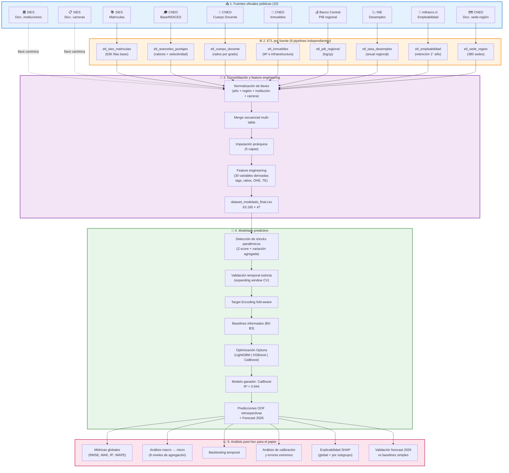

<div align="center">

# 🎓 Predicción de la dinámica de matrícula universitaria en Chile

### Un marco replicable de _machine learning_ con integración multifuente, validación temporal y tratamiento empírico del shock pandémico

[](https://www.python.org/)
[](LICENSE)
[](#)
[](https://catboost.ai)
[](https://optuna.org)
[](https://pandas.pydata.org)
[](https://jupyter.org)
[](https://shap.readthedocs.io)
[](#cómo-replicar)

</div>

---

> **TL;DR** — Marco completo de predicción de matrícula universitaria chilena a granularidad fina (institución × carrera × región × jornada × género × condición × año), integrando 10 fuentes oficiales. El modelo alcanza **R² = 0.944** y **WAPE = 15.0%** sobre el holdout 2025 a granularidad fina, escalando a **99.4% de confianza** al agregar a nivel nacional. Incluye método automatizado de detección de shocks pandémicos y cuantificación empírica del sesgo introducido por _target encoding_ mal aplicado.

---

## 📑 Tabla de contenidos

- [Resumen ejecutivo](#-resumen-ejecutivo)
- [Resultados destacados](#-resultados-destacados)
- [Arquitectura del pipeline](#-arquitectura-del-pipeline)
- [Fuentes de datos](#-fuentes-de-datos)
- [Pipeline de procesamiento](#-pipeline-de-procesamiento)
- [Estructura del repositorio](#-estructura-del-repositorio)
- [Cómo replicar](#-cómo-replicar)
- [Hallazgos metodológicos](#-hallazgos-metodológicos)
- [Limitaciones](#-limitaciones)
- [Trabajo futuro](#-trabajo-futuro)
- [Citar este trabajo](#-citar-este-trabajo)
- [Autor](#-autor)
- [Licencia](#-licencia)

---

## 📊 Resumen ejecutivo

### Qué hace este proyecto

Predice cuántos estudiantes se matricularán en cada combinación específica de **institución × carrera × región × jornada × género × condición** del sistema universitario chileno, para los años 2019-2026. Genera tanto **predicciones retrospectivas validadas** (2019-2025) como un **forecast a futuro (2026)**.

### Para quién es útil

- 🏛️ **Autoridades de política pública**: proyecciones nacionales con 99.4% de confianza para planificación de subsidios, dimensionamiento del Sistema Único de Admisión, y evaluación de sostenibilidad del Crédito con Aval del Estado (CAE).
- 🎓 **Universidades**: anticipación de matrícula institucional con ~96% de confianza, y por carrera específica con ~89% de confianza, útil para asignación de presupuesto docente, dimensionamiento de infraestructura y planificación de retención.
- 🔬 **Investigadores en ML aplicado a educación**: marco metodológico replicable con evidencia empírica sobre target encoding fold-aware, validación temporal estricta, y tratamiento documentado del shock pandémico.

### Pregunta de investigación

¿Es posible construir un modelo predictivo de matrícula universitaria chilena que mantenga utilidad a granularidad fina (programa específico) sin sacrificar precisión a nivel agregado (sistema nacional)?

**Respuesta: sí.** El modelo alcanza simultáneamente:
- 85% de confianza a granularidad fina (54.504 combinaciones únicas)
- 99.4% de confianza agregando al nivel nacional anual

---

## 🎯 Resultados destacados

### Métricas globales del modelo (CatBoost optimizado)

| Conjunto | n filas | RMSE | MAE | R² | WAPE (%) | Confianza (%) | Skill vs naïve |
|---|---:|---:|---:|---:|---:|---:|---:|
| **OOF retrospectivo (2019-2025)** | 54.721 | 36.64 | 13.40 | **0.877** | 18.36 | 81.64 | +62.13% |
| **Holdout 2025** | 7.752 | 26.59 | 11.56 | **0.944** | 15.01 | 84.99 | +49.45% |

### Precisión por nivel de agregación (Holdout 2025)

| Nivel | n grupos | Confianza (%) | R² |
|---|---:|---:|---:|
| Nacional anual | 1 | **99.36** | n/a |
| + Institución | 51 | 96.12 | 0.993 |
| + Área conocimiento | 390 | 93.73 | 0.987 |
| + Región | 598 | 93.08 | 0.988 |
| + Carrera | 2.197 | 89.52 | 0.963 |
| + Condición | 4.206 | 87.16 | 0.956 |
| + Género | 7.363 | 85.30 | 0.946 |
| + Jornada (granularidad fina) | 7.720 | 85.00 | 0.944 |

### 🎨 Visualizaciones clave

<div align="center">

**Backtesting temporal: histórico observado vs predicción OOF retrospectiva + forecast 2026**


**Evolución de la precisión del modelo al cambiar la granularidad de agregación**


**Predicciones vs valores reales en holdout 2025**


</div>

### Forecast 2026

> **612.578 estudiantes** proyectados a nivel nacional (+2.60% sobre 2025), consistente (±0.5 pp) con baselines basados en años post-pandémicos.

---

## 🏗️ Arquitectura del pipeline



---

## 📂 Fuentes de datos

Todas las fuentes son **públicas y oficiales**. Pueden descargarse directamente desde los organismos correspondientes:

| Fuente | Organismo | Variables aportadas | Período | URL oficial |
|---|---|---|---|---|
| **Base de matrículas SIES** | MINEDUC | Matrícula por institución × carrera × jornada × género × condición × año | 2018-2025 | [mifuturo.cl/bases-de-datos](https://www.mifuturo.cl/bases-de-datos-de-matriculados/) |
| **BaseINDICES CNED** | CNED | Aranceles, vacantes, puntajes de admisión, duración de carreras | 2005-2025 | [cned.cl/indices](https://www.cned.cl/bases-de-datos) |
| **Cuerpo Docente CNED** | CNED | Número de docentes por grado académico y jornada | 2018-2025 | [cned.cl/indices](https://www.cned.cl/bases-de-datos) |
| **Inmuebles e infraestructura CNED** | CNED | M² construidos, salas, oficinas por sede | 2018-2025 | [cned.cl/indices](https://www.cned.cl/bases-de-datos) |
| **PIB regional** | Banco Central de Chile | PIB regional anual a precios corrientes (MM$) | 2018-2025 | [bcentral.cl](https://www.bcentral.cl/web/banco-central/areas/estadisticas) |
| **Tasa de desocupación regional** | INE (SIMEL) | Tasa de desempleo anual por región y sexo | 2018-2025 | [ine.gob.cl](https://www.ine.gob.cl/) |
| **Buscador de Empleabilidad e Ingresos** | mifuturo.cl | Retención de primer año, empleabilidad por carrera-institución | 2018-2025 | [mifuturo.cl](https://www.mifuturo.cl/) |
| **Diccionario sede-región CNED** | CNED | Mapeo de códigos de sede a códigos INE de región (380 sedes) | Estático | CNED |
| **Diccionario de instituciones** | SIES | Catálogo canónico de 220 instituciones | Estático | MINEDUC |
| **Diccionario de carreras** | SIES | Catálogo canónico de 15.940 nombres de carrera | Estático | MINEDUC |

> ⚠️ **Nota sobre las bases de datos**: el repositorio NO incluye las bases originales ni el consolidado intermedio. Las fuentes son todas públicas y descargables desde los organismos. El procedimiento completo para reconstruir el dataset está documentado en el código.

---

## 🔧 Pipeline de procesamiento

### 1️⃣ Ingesta y ETL por fuente

Se desarrollaron **8 pipelines independientes** (uno por fuente o grupo de fuentes), cada uno responsable de:

- **Carga** con codificación `utf-8-sig` y separadores chilenos (`;` y `,`).
- **Validación de integridad**: nulos, duplicados, rangos esperados, cardinalidad.
- **Normalización**: nombres de regiones contra diccionario canónico, códigos institucionales contra SIES, nombres de carrera contra BBDD canónica.
- **Transformación específica**: agregación a la granularidad apropiada, cálculo de ratios estructurales, manejo de excepciones por fuente.
- **Export** en formato CSV chileno (`sep=';'`, `decimal=','`).

### 2️⃣ Consolidación

El consolidado final integra las 8 fuentes mediante **merge secuencial** sobre llaves comunes:

- **Llave maestra**: `año + región + institución`
- **Llave secundaria**: `año + región + institución + carrera + jornada + género + condición`

Tras el merge, se aplica un **sistema de imputación jerárquica de 5 capas** que respeta la lógica de granularidad:

| Capa | Aplica a | Llave de agrupación | % imputado |
|---|---|---|---|
| 1 — Temporal | Docente + Inmuebles | (institución, región) → interpolación lineal sobre año + ffill/bfill | 4.3% |
| 2 — Jerárquica | Aranceles + Retención | (institución, carrera) → (institución, área, año) → (área, año) | 18.1% |
| 2.5 — Región+carrera | Aranceles + Retención | (región, carrera, año) → (carrera, año) → (carrera) | 11.4% |
| 2.7 — Institución | Aranceles + Retención | (institución, año) → (institución) | 35.3% |
| 3 — Terminal | Ambos | Mediana global | 30.9% |

Luego se construyen **30 features derivadas**: lags temporales (`matriculas_lag1`), ratios estructurales (`pct_doctores`, `densidad_competitiva`), indicadores de mercado (`arancel_relativo_regional`, `concentracion_matricula_lag`), one-hot encoding de variables nominales, y target encoding fold-aware de categóricas de alta cardinalidad.

El resultado es `dataset_modelado_final.csv`: **63.165 filas × 47 columnas**, con 0 nulls y 0 duplicados.

### 3️⃣ Modelado predictivo

📓 [`Notebooks/modelado_predictivo_admision_v2.ipynb`](Notebooks/modelado_predictivo_admision_v2.ipynb)

**31 celdas** ejecutables secuencialmente que producen:

- **Detección automatizada de shocks pandémicos** (Criterio Z-score sobre tasas individuales + variación agregada YoY) → identifica 2020 (shock de nivel), 2021 (shock de dispersión), 2022 (shock de recaída).
- **Validación temporal estricta**: expanding window CV (5 folds: 2020-2024 como validación) + holdout fijo 2025.
- **Target encoding fold-aware** mediante `category_encoders.TargetEncoder` dentro de `sklearn.Pipeline`, garantizando que el encoding se ajuste solo con datos de entrenamiento de cada fold.
- **Baselines informados**: B0 (mediana constante), B1 (histórica por institución-carrera), B2 (Ridge solo lag), B3 (Ridge full).
- **Modelos candidatos**: LightGBM, XGBoost, CatBoost, Random Forest (sanity check).
- **Optimización con Optuna**: 50 trials por modelo, TPESampler + MedianPruner. CatBoost resulta ganador con RMSE CV = 0.3109 en escala arcsinh.
- **Experimento empírico TE-leaky vs TE-fold-aware**: cuantifica un sesgo del 2.0% del RMSE atribuible al uso ingenuo de target encoding precalculado.
- **Predicciones OOF retrospectivas** para 2019-2025 y **forecast 2026**.
- **Export del modelo final** (`joblib`) + metadata completa (`json`) + dataset de predicciones (`parquet` + `csv`).

### 4️⃣ Análisis post-hoc para el paper

📓 [`Notebooks/analisis_paper_resultados.ipynb`](Notebooks/analisis_paper_resultados.ipynb)

**20 celdas** que se ejecutan sobre el parquet de predicciones (no re-entrena nada) y producen:

- **Análisis macro → micro**: métricas en 8 niveles de agregación (de nacional anual a granularidad fina).
- **Análisis temporal**: desempeño año a año con efecto del crecimiento del conjunto de entrenamiento.
- **Backtesting agregado nacional** con bandas de shock pandémico anotadas.
- **Análisis de calibración** por decil de tamaño de matrícula.
- **Validación del forecast 2026** contra 3 baselines simples (regresión lineal, promedio años normales, último año).
- **Análisis de errores extremos** (top 15 mejores y peores predicciones).
- **Explicabilidad SHAP** global, por subgrupo y caso de estudio.
- **12 figuras en 300 dpi** + **9 tablas en Markdown** listas para el paper.

---

## 📁 Estructura del repositorio

```
Predictive-model-of-university-admission/
│
├── 📄 README.md                                    # Este documento
├── 📄 LICENSE                                      # Licencia MIT
├── 📄 .gitattributes
│
├── 📓 Notebooks/
│   ├── modelado_predictivo_admision_v2.ipynb       # Pipeline completo de modelado
│   └── analisis_paper_resultados.ipynb             # Análisis post-hoc para el paper
│
├── 📂 Documents/
│   ├── Predictive model of university admission.pdf            # Paper completo
│   ├── Predictive model of university admission.md             # Paper en Markdown
│   ├── PREDICTING UNIVERSITY ENROLLMENT DYNAMICS IN CHILE_*.pdf # Versión IFE Conference 2027
│   ├── OFICIAL_GLOSARIO_MATRICULA_WEB_E.pdf                    # Glosario oficial SIES
│   ├── BaseINDICES-2005-2025_*.pdf                              # Documentación CNED
│   ├── INDICES_Institucional_2005-2025_*.pdf                    # Documentación CNED
│   │
│   └── OUTPUTS_PAPER/
│       ├── figuras/                # 12 figuras del análisis (PNG 300dpi)
│       │   ├── fig01_distribucion_residuos.png
│       │   ├── fig02_scatter_pred_vs_real.png
│       │   ├── fig03_metricas_por_anio.png
│       │   ├── fig04_wape_por_region.png
│       │   ├── fig05_macro_a_micro.png
│       │   ├── fig06_evolucion_metricas_por_nivel.png
│       │   ├── fig07_calibracion.png
│       │   ├── fig08_backtesting_temporal_MONEY_FIGURE.png
│       │   ├── fig09_validacion_forecast_2026.png
│       │   ├── fig10_shap_top5_distribucion.png
│       │   ├── fig11_shap_por_subgrupo.png
│       │   └── fig12_caso_estudio_shap.png
│       │
│       └── tablas/                 # 9 tablas en formato Markdown
│           ├── tabla_resumen_paper.md
│           ├── tabla_macro_a_micro_OOF.md
│           ├── tabla_macro_a_micro_HOLDOUT.md
│           ├── tabla_metricas_por_anio.md
│           ├── tabla_metricas_por_region.md
│           ├── tabla_backtesting_anual.md
│           ├── tabla_shap_top5_resumen.md
│           ├── tabla_top15_mejores_predicciones.md
│           └── tabla_top15_peores_predicciones.md
│
└── 📂 BBDD/                        # Carpeta destinada a las bases originales
                                    # (NO se publican; debe poblarse manualmente
                                    # con las descargas oficiales)
```

---

## 🔄 Cómo replicar

### Requisitos

- **Python 3.11+**
- **Jupyter Notebook 7.x** o JupyterLab
- **Sistema operativo**: probado en Windows con locale español. Compatible con Linux/macOS ajustando rutas.
- **Hardware recomendado**: 16 GB RAM, CPU multi-núcleo (la optimización con Optuna paraleliza fits de modelos).

### Instalación

Recomendamos crear un entorno aislado:

```bash
# Con conda
conda create -n matricula python=3.11 -y
conda activate matricula

# Instalar dependencias
pip install numpy==1.26.4 pandas==2.2.0 scipy==1.13.1 scikit-learn==1.5.0 \
            lightgbm==4.5.0 xgboost==2.1.1 catboost==1.2.5 \
            optuna==4.0.0 shap==0.45.1 category_encoders==3.0.1 \
            joblib==1.4.2 seaborn==0.13.0 matplotlib==3.8.4 \
            nbformat==5.10.4 pyarrow==17.0.0
```

### Replicación paso a paso

#### Paso 1 — Obtener las bases originales

Descarga manualmente cada fuente desde el organismo oficial (URLs en la sección [Fuentes de datos](#-fuentes-de-datos)) y deposita los archivos en la carpeta `BBDD/`.

#### Paso 2 — Ejecutar el modelado predictivo

```bash
cd Notebooks
jupyter notebook modelado_predictivo_admision_v2.ipynb
```

Ejecuta las **31 celdas secuencialmente** (`Cell → Run All`). El notebook detecta automáticamente el dataset y produce:

- `OUTPUTS_MODELADO/predicciones_modelo_final_{timestamp}.parquet`
- `OUTPUTS_MODELADO/predicciones_modelo_final_{timestamp}.csv`
- `OUTPUTS_MODELADO/modelo_final_{timestamp}.joblib`
- `OUTPUTS_MODELADO/metadata_modelo_{timestamp}.json`

**Tiempos esperados:**
- Setup + EDA + baselines: ~5-10 min
- Optimización con Optuna (3 modelos × 50 trials): ~45-60 min
- Evaluación + SHAP + export: ~10 min
- **Total: ~60-80 min**

#### Paso 3 — Ejecutar el análisis post-hoc para el paper

```bash
jupyter notebook analisis_paper_resultados.ipynb
```

Ejecuta las **20 celdas** secuencialmente. Detecta automáticamente el parquet más reciente y produce:

- `OUTPUTS_PAPER/figuras/` — 12 figuras en 300 dpi
- `OUTPUTS_PAPER/tablas/` — 9 tablas en Markdown
- `OUTPUTS_PAPER/metricas_completas_paper.json` — trazabilidad completa

**Tiempo esperado: 2-5 min** (no re-entrena modelos, solo análisis sobre el parquet).

---

## 🔬 Hallazgos metodológicos

### 1. Target encoding fold-aware vs precalculado

Cuantificamos empíricamente que **un target encoding precalculado sobre todo el dataset infla el RMSE aparente en 2.0%** frente a su implementación correcta dentro del pipeline de cross-validation. Esta diferencia puede parecer modesta, pero en comparaciones entre modelos donde el primer y segundo lugar suelen diferir en 1-3% de RMSE, **un único error metodológico de TE puede invertir el ranking aparente** y conducir a conclusiones erróneas.

### 2. Detección automatizada de tres tipos de shock pandémico

Proponemos un método basado en dos criterios complementarios sobre la distribución del target:

- **Criterio 1**: Z-score sobre media y desviación estándar de las tasas individuales (umbral 95%).
- **Criterio 2**: Variación interanual del total agregado de matrículas.

Aplicado al caso chileno, identifica **automáticamente**:
- **2020** → shock de nivel (Z_mean = -2.19)
- **2021** → shock de dispersión (Z_std = +2.04)
- **2022** → shock de recaída (variación agregada negativa, no capturada por Z-score)

Este aporte rompe con el tratamiento monolítico ("años COVID") que predomina en la literatura aplicada.

### 3. La precisión crece monotónicamente con la agregación

Documentamos cómo **el error porcentual ponderado (WAPE) disminuye sistemáticamente al agregar**, pasando de 15.0% a granularidad fina (institución × carrera × región × jornada × género × condición × año) a 0.64% a nivel nacional anual. Esto tiene una implicación práctica directa: **el modelo es ideal para planificación a nivel sistema y útil con cautela para predicciones programa-específicas**, dada la varianza idiosincrática irreducible a esa granularidad.

### 4. La distinción entre tasa y nivel

Reportar métricas únicamente sobre tasas de crecimiento (R² ≈ 0.18 en escala arcsinh) puede subestimar significativamente la utilidad práctica de los modelos. **La métrica que importa para planificación es el número absoluto de matrículas predichas**, donde el modelo alcanza R² = 0.944.

---

## ⚠️ Limitaciones

- **Cobertura del universo**: solo universidades (56 instituciones, ~600K estudiantes). Centros de Formación Técnica (CFT) e Institutos Profesionales (IP) quedan fuera del alcance actual.
- **Heterogeneidad regional**: el desempeño es marcadamente menor en regiones con pocas observaciones (Aysén: 66.6% de confianza, Atacama: 73.5%).
- **Forecast 2026 bajo supuestos**: asume estabilidad de variables macroeconómicas (PIB regional, desempleo) al nivel 2025.
- **Naturaleza descriptiva, no causal**: las contribuciones SHAP identifican asociaciones, no relaciones causales.
- **Imputación masiva**: el 35% de las celdas de aranceles fueron imputadas en la capa terminal (mediana global); el modelo conoce este hecho vía la flag `fue_imputado`.

---

## 🚀 Trabajo futuro

1. **Extensión al ecosistema CFT/IP**: replicar el pipeline en los subsectores no-universitarios.
2. **Modelado jerárquico**: aplicar técnicas de partial pooling (modelos bayesianos jerárquicos) para mejorar el desempeño en regiones de baja cardinalidad.
3. **Análisis de sensibilidad explícita** del forecast a supuestos macroeconómicos (PIB, desempleo).
4. **Integración de variables idiosincráticas no observadas**: datos de admisión institucional, campañas de marketing, satisfacción estudiantil, decisiones internas.
5. **Aplicación Streamlit**: visualización interactiva del histórico observado, predicciones OOF retrospectivas y forecast 2026 a la granularidad que cada usuario requiera.

---

## 📚 Citar este trabajo

Si utilizas este código, los hallazgos metodológicos o las predicciones generadas, por favor cita este trabajo:

### BibTeX

```bibtex
@article{evans2026matricula,
  title  = {Predicción de la dinámica de matrícula universitaria en Chile mediante 
            machine learning: un marco replicable con integración multifuente, 
            validación temporal y tratamiento empírico del shock pandémico},
  author = {Pérez Paz, Diego Evans},
  year   = {2026},
  month  = {6},
  note   = {Disponible en \url{https://github.com/diegoevans2-arch/Predictive-Model-of-University-Admission---Latam-CL}}
}
```

### APA 7

> Pérez Paz, D. E. (2026). *Predicción de la dinámica de matrícula universitaria en Chile mediante machine learning: un marco replicable con integración multifuente, validación temporal y tratamiento empírico del shock pandémico*. https://github.com/diegoevans2-arch/Predictive-Model-of-University-Admission---Latam-CL

---

## 👤 Autor

**Diego Evans Pérez Paz**

[](https://github.com/diegoevans2-arch)

Para consultas sobre el código, replicación o colaboración académica, abre un [issue](https://github.com/diegoevans2-arch/Predictive-Model-of-University-Admission---Latam-CL/issues) en el repositorio.

---

## 📜 Licencia

Este proyecto se distribuye bajo licencia [MIT](LICENSE). El código puede ser utilizado, modificado y distribuido libremente, incluyendo uso comercial, siempre que se preserve el aviso de copyright original.

Las **fuentes de datos** son propiedad de sus respectivos organismos públicos (MINEDUC, CNED, INE, Banco Central de Chile, mifuturo.cl) y se rigen por sus propios términos de uso.

---

<div align="center">

**¿Te resultó útil este trabajo?** ⭐ Considera darle una estrella al repositorio.

_Construido con 🐍 Python, ❤️ rigor metodológico, y ☕ mucho café._

</div>
